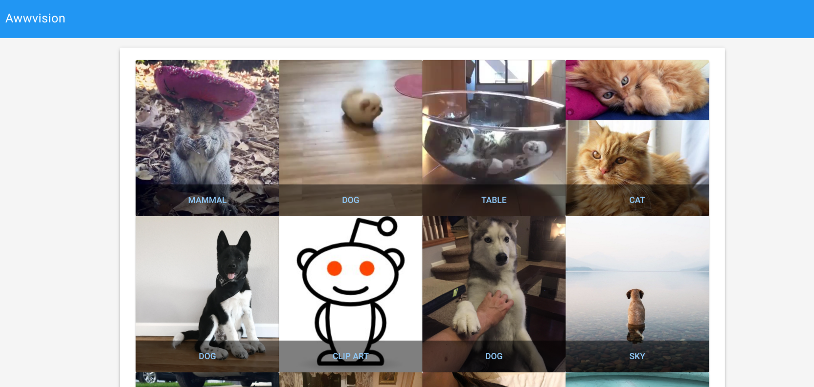

# Bootiful-Vision: Spring Boot edition

*Bootiful-Vision: Spring Boot edition* is a [Spring Boot](http://projects.spring.io/spring-boot/) demo application that uses the [Google Cloud Vision API](https://cloud.google.com/vision/) to classify (label) images from Reddit's [/r/aww](https://reddit.com/r/aww) subreddit, store the images and classifications in [Google Cloud Storage](https://cloud.google.com/storage/), and display the labeled results in a web app. It uses the GCP Service Broker to authenticate to the Vision and Storage APIs, and is based off of the [Python Awwvision sample app](https://github.com/GoogleCloudPlatform/cloud-vision/tree/master/python/awwvision) and adapted based on the original example from the [google-service-broker](https://github.com/GoogleCloudPlatform/gcp-service-broker) [spring example](https://github.com/GoogleCloudPlatform/gcp-service-broker/tree/master/examples/spring/awwvision). 

It is slighlty adapted to use spring cloud services. This code sample shows how the Spring Cloud GCP integrations can simplify the use of Google Cloud Platform Java Client Libraries.

It uses the [Google Cloud Vision API](https://cloud.google.com/vision/) to extract information about a picture.
We take advantage of the [GCP Support starter](https://github.com/spring-cloud/spring-cloud-gcp/blob/master/spring-cloud-gcp-starters/spring-cloud-gcp-starter) to retrieve
the GCP credentials that we will use to authenticate with the API.

*Bootiful-Vision*: Spring Boot edition has two endpoints:

1. A webapp that reads and displays the labels and associated images from GCS.
2. A scraper that downloads images from Reddit and classifies them using the Vision API.

## GCP Pre-Requisites

1. Create a project in the [Google Cloud Platform Console](https://console.cloud.google.com).

1. [Enable billing](https://console.cloud.google.com/project/_/settings) for your project.

1. Enable the [Vision](https://console.cloud.google.com/apis/api/vision.googleapis.com) and [Storage](https://console.cloud.google.com/apis/api/storage_component) APIs. See the [Vision API Quickstart](https://cloud.google.com/vision/docs/quickstart) and [Storage API Quickstart](https://cloud.google.com/storage/docs/quickstart-console) for more information on using the two APIs.
1. Authenticate in one of two ways:

	* Use the Google Cloud SDK to [authenticate with
  application default credentials](
  https://developers.google.com/identity/protocols/application-default-credentials#toolcloudsdk) .
	* [Create a new service account] (https://cloud.google.com/iam/docs/creating-managing-service-accounts), download its private key and point the `spring.cloud.gcp.credentials.location` property
  to it.
  
	>   e.g.: `spring.cloud.gcp.credentials.location=file:/path/to/creds.json`

## Local Execution
4. Run the `$ mvn spring-boot:run` command from the same directory as the `pom.xml` file.

5. Go to http://localhost:8080 in your browser, paste a URL to an image and press the `Submit` button.

6. You will see a readable version of the Google Cloud Vision API response, which contains the words
that Google Cloud Vision attributed to your image, as well as a percentage of certainty.

In this case, by using the Spring Cloud GCP Core Boot starter, you can inject a `CredentialsProvider` object which you
can pass to our API to provide the correct Google credentials.
You don't need to set any environment variables for authentication to work.

## Cloud Foundry Pre-requsites

### 1. Confirm access to Cloud Foundry

Run `cf apps` to ensure you're connected and authenticated to Cloud Foundry. If the command fails ensure you've logged in.

> Log in to your Cloud Foundry using the `cf login` command.


### 2. Create a org and space for development

Cloud Foundry uses orgs and spaces to contain applications and services.
Create and target an org and space for your development with the following commands:

```bash
cf create-org dev
cf create-space -o dev gcp
cf target -o dev -s gcp
```

### 3. Ensure Maven/JDK8 is Installed

This sample app requires [maven](https://maven.apache.org/index.html)
and Java 1.8 to build. Users of [Google Cloud Shell](https://cloud.google.com/shell/docs/)
will have this by default.

Confirm with the following commands:

```bash
mvn -version # look for: Apache Maven 3+
java -version # look for: version "1.8"
```

### 4. Build and deploy the application
From the main project directory, build an executable jar and push it to Cloud Foundry. From the root directory of this project (`bootiful-vision`) run the following commands:

```bash
mvn package -DskipTests && cf push -p target/bootiful-vision-1.0.0-SNAPSHOT.jar --no-start
```

### 5. Create/Bind Google Services

Create a Google Cloud Storage service and bind it to the application.

> The services are provisioned by the
[GCP Service Broker](https://docs.pivotal.io/partners/gcp-sb/index.html) so we will not need to leave Cloud Foundry to create them or setup authentication.

Run the following commands:

1. Create a Storage Bucket:

    ```
	cf create-service google-storage standard bootiful-vision-storage
    ```
> This provisions a new [storage bucket](https://cloud.google.com/storage/docs/json_api/v1/buckets) and [service account](https://cloud.google.com/compute/docs/access/service-accounts) with the role 'storage.objectAdmin'. 


1. Bind the bucket to the app and give the service account storage object admin permissions:

    ```
    cf bind-service awwvision awwvision-storage -c '{"role":"storage.objectAdmin"}'
    ```
> The bind command will also create a new [service account key](https://cloud.google.com/iam/docs/creating-managing-service-account-keys)
for your application to authenticate to Google Cloud Storage.


1. Restage the app so the new environment variables take effect:

    ```
    cf restage bootiful-vision
    ```

To view the credentials, try: `cf env bootiful-vision`

### 6. Start and bootiful-vision

The app can now be started and hostname retrieved with the following commands:

```bash
cf start bootiful-vision
cf apps
```

Enter the URL into your browser (eg: http://bootiful-vision-...apps...)
and click on 'Update with latest images'. This may take up to 30 seconds.
Follow the link back to the homepage and view the resulting images:



Click on the text category to view the related images, for example click 'Dog'


## Clean up

Find the name of the Google Cloud Storage bucket by running the following command and looking for "bucket_name":

```bash
cf env bootiful-vision
```

Clear the contents of the bucket:

```bash
gsutil rm gs://<bucket name>/*
```

Delete the binding, service, and app:

```bash
cf unbind-service bootiful-vision bootiful-vision-storage
cf delete-service bootiful-vision-storage
cf delete bootiful-vision
```

## What's Next?
- [Related Resources](../README.md#resources)
- [Delete Deployment](./deleting-deployment.md)
